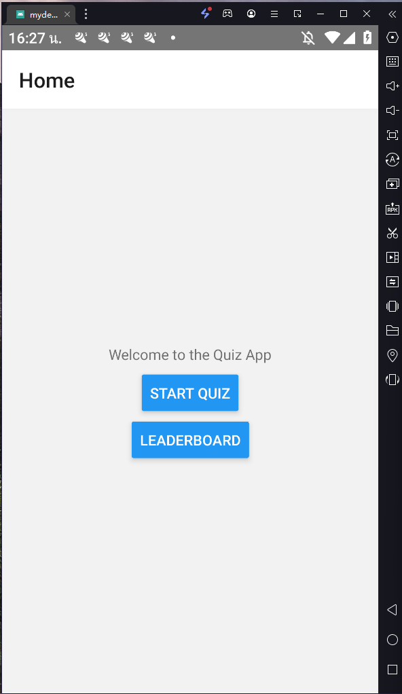
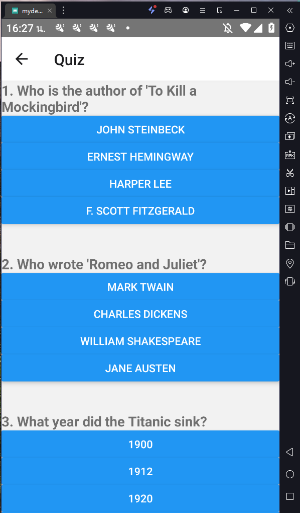
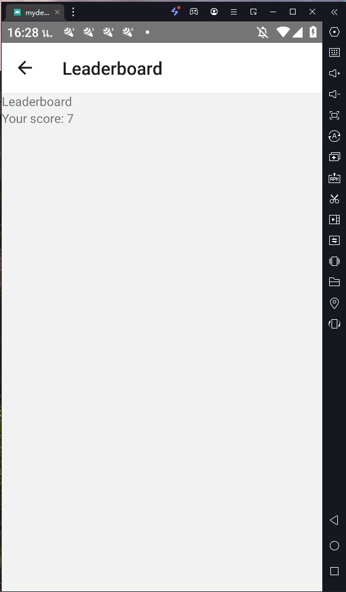

This is a new [**React Native**](https://reactnative.dev) project, bootstrapped using [`@react-native-community/cli`](https://github.com/react-native-community/cli).

# Quiz App

## Description

>**Note**: This is a simple quiz application built using React Native with TypeScript. The app allows users to take a quiz consisting of 20 random questions, each with 4 possible answers. After completing the quiz, users can view their score on the leaderboard.

## Features

- Display 20 random questions with 4 answer choices each.
- Allow users to select an answer for each question.
- Provide instant feedback on whether the selected answer is correct or incorrect.
- Calculate and display the final score at the end of the quiz.
- Navigate to the leaderboard screen to view the score.

## Screens

### Home Screen



- Display two buttons: **Start Quiz** and **Leaderboard**.
- **Start Quiz** button navigates the user to the quiz screen.
- **Leaderboard** button navigates the user to the leaderboard screen.

### Quiz Screen



- Display 20 random questions with 4 answer choices each.
- Allow the user to select one answer for each question.
- Display instant feedback (correct or incorrect) for each selected answer.
- Calculate and display the final score at the end of the quiz.
- Provide a button to navigate to the leaderboard screen.

### Leaderboard Screen



- Display the user's final score obtained from the quiz.
- If the score is not available (e.g., user navigated directly to the leaderboard screen without completing the quiz), display an alert message and navigate back to the home screen.

## Technologies Used

- React Native
- TypeScript
- React Navigation
- LD Player 9

## Installation

1. Clone the repository: 
```bash 
git clone https://github.com/6010110455/mydev_health_plaza_QuizApp.git
```
2. Install dependencies: 
```bash
cd mydev_health_plaza_QuizApp
npm install
```
3. Run the app:
```bash 
npm run android
```

# Troubleshooting

If you can't get this to work, see the [Troubleshooting](https://reactnative.dev/docs/troubleshooting) page.

# Learn More

To learn more about React Native, take a look at the following resources:

- [React Native Website](https://reactnative.dev) - learn more about React Native.
- [Getting Started](https://reactnative.dev/docs/environment-setup) - an **overview** of React Native and how setup your environment.
- [Learn the Basics](https://reactnative.dev/docs/getting-started) - a **guided tour** of the React Native **basics**.
- [Blog](https://reactnative.dev/blog) - read the latest official React Native **Blog** posts.
- [`@facebook/react-native`](https://github.com/facebook/react-native) - the Open Source; GitHub **repository** for React Native.
